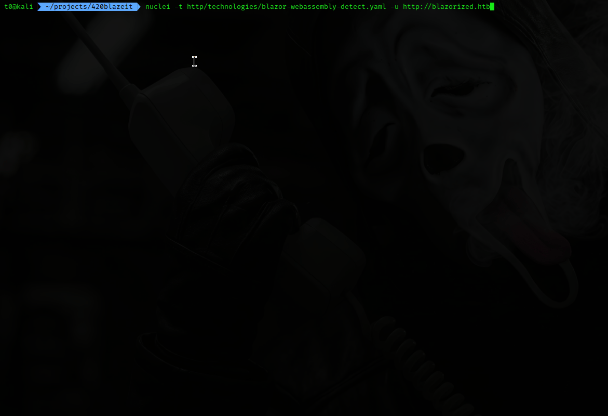

# 420blazeit

## Legal
Legal / Authorized Use Only

This tool is intended for:

- security research
- defensive security testing
- bug bounty programs
- environments you own or have explicit permission to test

Do not use this tool against systems without authorization.

The authors assume no liability and are not responsible for misuse, damage, data loss, service disruption, or legal consequences resulting from the use of this software.

Users are responsible for ensuring their activities comply with all applicable laws, regulations, and program policies.

## What is it?

420blazeit scans a target for ASP.NET Blazor WebAssembly applications, downloads the referenced DLLs, decompiles them using ILSpy, and searches the resulting source code for exposed secrets using Gitleaks.

This can help identify:
- hardcoded API keys
- JWT secrets
- connection strings
- cloud credentials
- accidentally exposed sensitive data

## How to use it

```bash
# with uv and docker installed
chmod +x install.sh
./install.sh

# use the included nuclei template to identify Blazor WebAssembly targets
nuclei -t http/technologies/blazor-webassembly-detect.yaml -u $URL

# run the scanner
uv run 420blazeit.py http://blazorized.htb
```

# Demo

